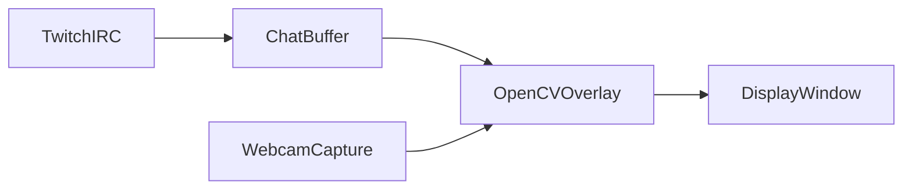

# Twitch Chat Webcam Overlay

## Overview

This project displays chat as an overlay on top of your webcam feed in real time. The MVP uses **Python + OpenCV** with **simulated chat** by default; you can switch to **OpenAI-generated** lines (`--ai` + `OPENAI_API_KEY`) or **real Twitch IRC** (`--live` + Twitch credentials).

---

## Repository status

- **Intended stack (this document):** Python 3.8+, OpenCV, raw Twitch IRC (`irc.chat.twitch.tv`), local webcam capture, threaded chat listener, overlay composited on each frame.
- **Current repository:** Create React App scaffolding exists (`package.json`, `src/`) from the default template. The Python overlay lives in `overlay/main.py` with root `requirements.txt` and `.env.example`.
- **Layout:** `overlay/main.py` (default: `python -m overlay.main` = simulated chat, no keys), `requirements.txt`, optional `.env` for camera tuning, OpenAI, or Twitch (gitignored; see `.env.example`). Keep secrets out of git (see [Configuration and security](#configuration-and-security)).

---

## Features

- Live webcam feed
- Real-time Twitch chat integration
- On-screen chat overlay
- Lightweight and local
- Easily extendable (styling, AI, filters)

---

## Goals and MVP

**Goals**

- Show a live camera preview with a readable chat panel.
- Ingest Twitch chat over IRC with minimal dependencies.
- Run entirely on the streamer’s machine; no mandatory cloud service for MVP.

**MVP (done when)**

- Connect to Twitch IRC with a valid OAuth token, join the target channel, and stay connected while handling `PING`/`PONG`.
- Append incoming `PRIVMSG` lines to a bounded buffer (e.g. last N messages) in a background thread.
- Composite a semi-transparent panel and the last N lines onto each webcam frame; display in an OpenCV window.
- Exit cleanly on `ESC`; release the camera and close sockets where applicable.
- Parse failures (malformed lines, non-chat traffic) are ignored **without** crashing; production code should log or count skips instead of a bare `except` (see [Reference implementation (prototype)](#reference-implementation-prototype)).

---

## Architecture



Plain-text diagram (same data flow):

```
Twitch IRC → Python Socket → Chat Buffer
                               ↓
                        OpenCV Renderer ← Webcam frames
                               ↓
                         Display Window
```

---

## Project plan

Execute in order. Each phase lists tasks and acceptance criteria (“Done when”).

### Phase 0 — Environment

**Tasks**

- Use Python 3.8+ and a virtual environment.
- Install `opencv-python`. Optionally add `python-dotenv` to load credentials from a `.env` file (recommended).
- Add `requirements.txt` when the Python package is created; pin versions once stable.

**Done when**

- A clean venv can run the overlay script without missing-module errors.

### Phase 1 — IRC client hardening

**Tasks**

- Keep `PING` / `PONG` handling; ensure responses are not truncated across `recv` boundaries (buffer partial lines until `\r\n`).
- Use UTF-8 for decode/encode; handle non-ASCII chat where possible.
- Narrow exception handling around PRIVMSG parsing; optionally log malformed lines during development.
- Plan for disconnects: exponential backoff reconnect, cap on retries, surface “disconnected” in overlay or logs.
- Review Twitch expectations for chat connections and rate limits: [Twitch IRC guide](https://dev.twitch.tv/docs/irc/).

**Done when**

- The client survives normal chat load, responds to `PING`, and recovers from a dropped connection without manual restart (per your chosen reconnect policy).

**Note on tokens:** `https://twitchapps.com/tmi/` is a common shortcut for a chat-capable token; for production or redistribution, prefer the official OAuth flow: [Getting OAuth access tokens](https://dev.twitch.tv/docs/authentication/getting-tokens-oauth/).

### Phase 2 — Webcam pipeline

**Tasks**

- Parameterize camera index (default `0`); document trying `1`, `2`, … if no device opens.
- Optionally set capture width/height and FPS to reduce CPU use.
- On `cap.read()` failure, show a clear message or exit gracefully instead of a tight spin loop.

**Done when**

- The chosen camera produces a steady preview with acceptable CPU use for your machine.

### Phase 3 — Overlay UX

**Tasks**

- Truncate or wrap long lines; tune font scale and line spacing for readability.
- Keep a fixed visible line count (the prototype uses the last 8 lines) or implement scrolling.
- Be aware OpenCV’s built-in fonts do not render emoji well; advanced typography may need PIL/Pillow or another renderer (backlog).

**Done when**

- Typical chat lines remain readable at your streaming resolution without overlapping the whole scene.

### Phase 4 — OBS / streaming

**Tasks**

- Document Window Capture of the OpenCV window (current approach).
- Optional stretch: output to a **virtual camera** (e.g. `pyvirtualcam` or OS-specific tools) so OBS can use a Video Capture Device instead of Window Capture—treat as later work.

**Done when**

- You can capture the overlay reliably in OBS for a test stream.

### Phase 5 — Prioritized backlog

See [Prioritized backlog](#prioritized-backlog) for P1–P3 items consolidated from former “Future improvements” and “Advanced ideas” lists.

---

## Prioritized backlog

**P1 — High impact / common needs**

- Chat filtering (bad words, bots) and basic moderation hooks
- Highlight `@mentions` of the broadcaster
- User color mapping (match Twitch web colors where feasible)
- Thread-safe buffer: use `threading.Lock` or `collections.deque(maxlen=N)` for the chat list

**P2 — UX and polish**

- Rounded chat box, custom fonts, improved contrast
- Emoji rendering (likely via Pillow or similar)
- Limit redraw regions or dirty rectangles for performance
- GPU-accelerated compositing (platform-dependent)

**P3 — Stretch / integrations**

- Alerts (subs, donations) via EventSub or other APIs—separate from IRC MVP
- Chat summarization (AI) and optional voice playback of messages
- Connect to a React frontend via WebSockets (aligns with existing CRA scaffold if you unify stacks later)
- Virtual camera output for OBS

---

## Requirements

- Python 3.8+
- OpenCV (`opencv-python`)
- Internet connection

Install dependencies:

```bash
pip install opencv-python
```

Optional:

```bash
pip install python-dotenv
```

---

## Configuration and security

**Environment variables (recommended names)**

| Variable | Purpose |
|----------|---------|
| `TWITCH_NICK` | IRC nick (often the bot or account name) |
| `TWITCH_TOKEN` | OAuth token, including `oauth:` prefix |
| `TWITCH_CHANNEL` | Channel to join, with `#` prefix (e.g. `#your_channel`) |
| `CAMERA_INDEX` | Optional integer, default `0` |

**Example `.env.example` (commit this; never commit real secrets)**

```env
TWITCH_NICK=your_bot_username
TWITCH_TOKEN=oauth:your_token_here
TWITCH_CHANNEL=#your_channel
CAMERA_INDEX=0
```

**Security practices**

- Never commit OAuth tokens or `.env` with real credentials.
- Tokens need appropriate scopes for chat; generating tokens via the [Twitch developer console](https://dev.twitch.tv/console) is preferred for anything beyond personal experiments.
- **Bot vs broadcaster:** a separate bot account can keep your broadcaster token out of a simple script; joining your own channel for read-only display works with either pattern depending on Twitch IRC login rules—verify with current Twitch docs for your use case.

---

## Testing and validation

Manual checks before relying on stream:

- [ ] IRC connects and joins; chat messages appear in the buffer
- [ ] `PING` from server is answered; connection does not drop idle
- [ ] Long usernames and long messages truncate or wrap without crashing
- [ ] Non-ASCII characters display or degrade gracefully
- [ ] Camera index `0` vs `1` documented if multiple devices exist
- [ ] `ESC` exits; no zombie threads or locked camera device (best effort on your OS)

---

## Twitch setup

1. Obtain an OAuth token with access suitable for IRC chat (see [Getting OAuth access tokens](https://dev.twitch.tv/docs/authentication/getting-tokens-oauth/)). For quick local tests, some developers use: https://twitchapps.com/tmi/ — understand the tradeoffs for production.
2. Note your IRC **username** (nick), **token**, and **channel** name (with `#` for `JOIN`).

---

## Reference implementation (prototype)

The script below is a **starting point**, not production-hardened. Replace bare `except` with logging or specific exception types; add line buffering for IRC as in Phase 1.

### Full script

```python
import cv2
import socket
import threading

# ====== TWITCH CONFIG ======
SERVER = 'irc.chat.twitch.tv'
PORT = 6667
NICK = 'your_bot_username'
TOKEN = 'oauth:your_token'
CHANNEL = '#your_channel'

chat_messages = []

# ====== TWITCH CHAT LISTENER ======
def twitch_chat():
    sock = socket.socket()
    sock.connect((SERVER, PORT))
    sock.send(f"PASS {TOKEN}\n".encode('utf-8'))
    sock.send(f"NICK {NICK}\n".encode('utf-8'))
    sock.send(f"JOIN {CHANNEL}\n".encode('utf-8'))

    while True:
        resp = sock.recv(2048).decode('utf-8')

        if resp.startswith('PING'):
            sock.send("PONG\n".encode('utf-8'))
        else:
            try:
                user = resp.split('!')[0][1:]
                message = resp.split('PRIVMSG')[1].split(':', 1)[1]

                chat_messages.append(f"{user}: {message.strip()}")

                if len(chat_messages) > 10:
                    chat_messages.pop(0)
            except:
                pass

# Run chat listener in background
threading.Thread(target=twitch_chat, daemon=True).start()

# ====== WEBCAM ======
cap = cv2.VideoCapture(0)

while True:
    ret, frame = cap.read()
    if not ret:
        break

    # Draw semi-transparent background box
    overlay = frame.copy()
    cv2.rectangle(overlay, (0, 0), (400, 300), (0, 0, 0), -1)
    alpha = 0.4
    frame = cv2.addWeighted(overlay, alpha, frame, 1 - alpha, 0)

    # Draw chat messages
    y0 = 30
    for i, msg in enumerate(chat_messages[-8:]):
        y = y0 + i * 30
        cv2.putText(frame, msg, (10, y),
                    cv2.FONT_HERSHEY_SIMPLEX,
                    0.6, (0, 255, 0), 2)

    cv2.imshow("Twitch Chat Overlay", frame)

    if cv2.waitKey(1) & 0xFF == 27:
        break

cap.release()
cv2.destroyAllWindows()
```

---

## How to run

1. Install Python dependencies from the repository root:

```bash
pip install -r requirements.txt
```

2. Run the overlay (MVP uses **simulated chat**; no Twitch or OpenAI keys required):

```bash
python -m overlay.main
```

Optional modes:

- **AI-generated fake chat** (set `OPENAI_API_KEY` in the environment or `.env`): `python -m overlay.main --ai`
- **Real Twitch IRC** (set `TWITCH_NICK`, `TWITCH_TOKEN`, `TWITCH_CHANNEL`): `python -m overlay.main --live`

See `.env.example` for optional variables (`CAMERA_INDEX`, OpenAI tuning, Twitch credentials).

To use the single-file prototype in this document instead, save it as `your_script.py` and run `python your_script.py`.

3. Press `ESC` to exit.

---

## Optional: OBS integration

To use this in streaming software:

- Add a **Window Capture** source
- Select the OpenCV window

**Stretch:** feed a virtual camera so OBS uses **Video Capture Device** instead of Window Capture; see P3 in [Prioritized backlog](#prioritized-backlog).

---

## Troubleshooting

| Symptom | Things to check |
|--------|-------------------|
| No chat messages | Valid OAuth token; nick matches token; channel includes `#`; account banned or missing permission in channel |
| Connection drops idle | `PING`/`PONG`; partial line buffering; add reconnect (Phase 1) |
| Garbled or split messages | IRC data split across `recv` calls—buffer until `\r\n` before parsing |
| Webcam not working | Try `cv2.VideoCapture(1)` or set `CAMERA_INDEX`; close other apps using the device |
| Lag / high CPU | Lower resolution or FPS on capture; render fewer lines; smaller preview window |
| TLS / port questions | This prototype uses plain `6667`; Twitch also documents TLS IRC—if you switch ports, update socket code accordingly |

### No chat messages (detail)

- Check OAuth token
- Ensure channel name starts with `#`

### Webcam not working

Try changing camera index:

```python
cap = cv2.VideoCapture(1)
```

### Lag issues

- Reduce resolution
- Limit chat messages rendered

---

## License

MIT License

---

## Notes

This project is a foundation for building more advanced real-time overlay systems, including AR-style interfaces and intelligent context-aware streaming tools.

If you later prefer a **browser / OBS Browser Source** overlay, the existing Create React App app could be repurposed; that path is separate from the Python/OpenCV plan above.
